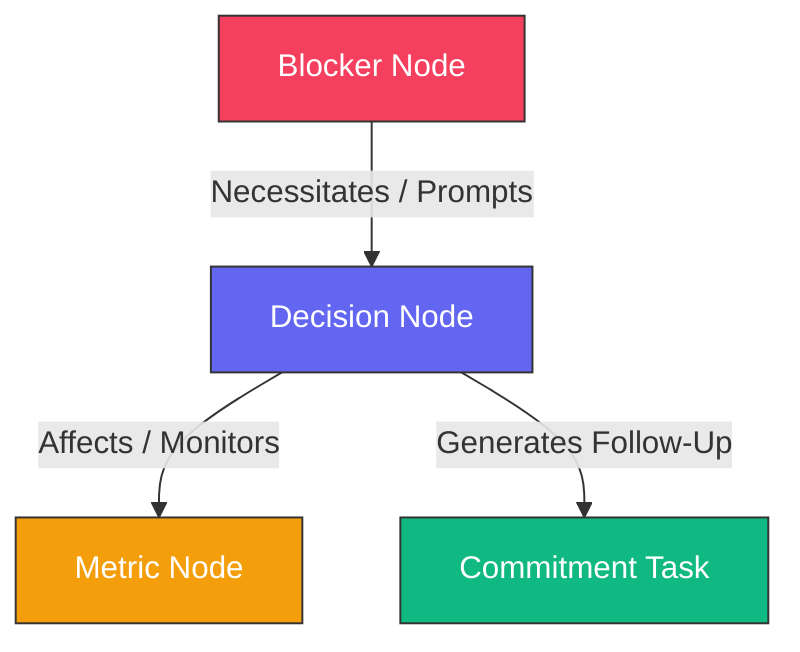

# FounderOps AI: Founder Memory & Decision Intelligence Platform

**FounderOps AI** is a premium, production-quality frontend layer that aggregates startup founder activity across emails, chats, project management logs, and stripe payments into structured, queryable corporate memory.

Built on top of a secure, sandboxed execution framework, FounderOps transforms scattered workspace noise into four core relational memory primitives: **Decisions**, **Commitments**, **Blockers**, and **Metrics**.

---

## 🚀 Tech Stack & Requirements

### System Prerequisites
* **Node.js**: `v20.x` or higher (Recommended: `v22.x`)
* **NPM**: `v10.x` or higher (or yarn / pnpm equivalents)

### Primary Libraries Used
* **Framework**: Next.js 16.2 (App Router, compiled statically)
* **Language**: TypeScript 5.x
* **Styling**: Tailwind CSS v4 (configured in dark mode by default)
* **Interactive Visualization**: `@xyflow/react` (React Flow 12)
* **Data Visualizations**: `recharts`
* **Icons**: `lucide-react`

---

## 🛠️ Getting Started & Installation

1. **Clone the repository** (or navigate to the project directory)
2. **Install dependencies**:
   ```bash
   npm install
   ```
3. **Start the local development server**:
   ```bash
   npm run dev
   ```
   Open [http://localhost:3000](http://localhost:3000) in your browser to view the application.

4. **Verify TypeScript & Build production bundles**:
   ```bash
   npm run build
   ```

---

## 📁 Project Architecture

The application is structured following clean coding boundaries, separating data models, mock databases, business logic, components, and pages:

```bash
src/
├── app/                      # Next.js App Router Page layouts
│   ├── ask/                  # Ask FounderOps (Perplexity Chat)
│   ├── daily-brief/          # Daily Brief newsletter summaries
│   ├── insights/             # Founder Insights metrics graphs
│   ├── memory-explorer/      # Searchable, filtered memory tables
│   ├── memory-graph/         # React Flow interactive canvases
│   ├── weekly-review/        # Strategic Weekly reviews
│   ├── globals.css           # Styling configuration (Zinc-950 Dark theme)
│   └── layout.tsx            # Main layout wrapper injecting Sidebar navigation shell
├── components/               # Shared React Components
│   ├── icons/                # Brand SVGs (Slack)
│   ├── MemoryDetailPanel.tsx # Right-sliding slide-out drawer panel
│   └── Sidebar.tsx           # Global navigation and Operational Health status bar
├── mock-data/
│   └── memories.ts           # Realistic database containing 50+ interconnected founder events
├── services/                 # Abstraction layer services querying mock data
│   ├── analyticsService.ts   # Completion ratios and Health score mathematics
│   ├── dashboardService.ts   # Main KPIs and Priorities timeline aggregators
│   ├── memoryService.ts      # Fuzzy search filters and React Flow nodes calculations
│   └── queryService.ts       # Chat synthesis citation mapper
└── types/
    └── index.ts              # Core TypeScript interfaces for decisions, blockers, etc.
```

---

## 🔗 Memory Relationship Schema

Every ingested memory item connects with other primitives to build an audit trail of decisions made:



* **Decisions** link to multiple **Blockers** (representing the obstacles that triggered the decision) and multiple **Metrics** (representing the metrics affected or monitored).
* **Commitments** link to a single **Decision** (representing the choice that generated the action item).
* All primitives carry full **Provenance Metadata** (originating author, source client Gmail/Slack/Notion, timestamps, and message reference links) to guarantee transparency.

---

## 🖥️ Screen Demonstrations

1. **Dashboard Cockpit**: Displays active KPIs, priority calendars, a health index area chart, and a scrolling activity feed sync.
2. **Ask FounderOps (Q&A)**: Renders a Perplexity-style prompt form that returns synthesized operational reports quoting original email/Slack messages.
3. **Memory Explorer**: Full-text searching and categorization toggles. Clicking on a card slides open the detail drawer.
4. **Memory Graph**: Drag and zoom nodes using React Flow, visualising Blocker ➔ Decision ➔ Metric ➔ Commitment tracks.
5. **Daily Brief**: newsletter-style briefings with mock tools to trigger sandboxed TrustClaw deployments.
6. **Weekly Review**: Reports summarizing strategic decisions, resolved threats, and weekly performance numbers.
7. **Founder Insights**: Visual bar, line and dial charts tracking developer velocity and operational progress.
